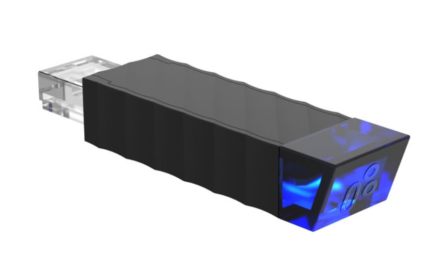

Fork of [esphome-idasen-desk-controller](https://github.com/j5lien/esphome-idasen-desk-controller) for  [TiMOTION TWD1 Series](https://www.timotion.com/en/products/accessories/twd1-series) controller bluetooth module.  
Alternative for [Stand Up Pls.](https://play.google.com/store/apps/details?id=com.timotion.standuppls) android app.  
 

  
## BT communication protocol - reverse engineering

```bash
# example module notifications

When moving
(0x) 9D-01-70-00-55-64-02-FD-00-00-00-00-00-28
(0x) 9D-01-70-00-55-64-03-02-00-00-00-00-00-2E
(0x) 9D-01-70-00-65-64-03-02-00-00-00-00-00-3E
(0x) 9D-01-70-00-65-64-02-FE-00-00-00-00-00-39
                       /\ /\ desk height in hex
                 /\ move status: 65 down, 55 up
        /\ move status: 01 moving

When idling (no precise desk height information)
(0x) 9D-02-70-20-05-64-02-98-04-1D-02-98-04-21-02-C4-03-AB-67
(0x) 9D-02-70-40-05-64-02-98-04-1D-02-98-04-21-02-C4-03-AB-07
(0x) 9D-02-70-00-05-64-02-98-04-1D-02-98-04-21-02-C4-03-AB-47
                       /\ /\ no height information
              /\ height limit: 20 at upper limit, 40 at lower limit, 00 in the middle
        /\ move status: 02 idling

# example commands send by mobile app
(WIP)
```
Reading status is quite simple, just decode height and status hex value from notification.  
  
## Dependencies
* This component requires an [ESP32 device](https://esphome.io/devices/esp32.html).
* [ESPHome 2021.10.0 or higher](https://github.com/esphome/esphome/releases).
* bluetooth module [TiMOTION TWD1](https://www.timotion.com/en/products/accessories/twd1-series).

## Installation
! If necessary, just follow original instruction of [esphome-idasen-desk-controller](https://github.com/j5lien/esphome-idasen-desk-controller)

You can install this component with [ESPHome external components feature](https://esphome.io/components/external_components.html) like this:
```yaml
external_components:
  - source: github://duchu-net/esphome-timotion-desk-controller@v0.0.2
  # or clone, and serve from locally
  - source:
      type: local
      path: components/esphome-timotion-desk-controller/components
```

## Configuration
ESPHome `yaml` example: [esphome-timotion-desk-controller.yaml](./esphome-timotion-desk-controller.yaml).

## TiMOTION Trademark Notice
The TiMOTION name and logo are trademarks of TiMOTION Technology Co. Ltd. All Rights Reserved. Is not part of the licensing for this project.
