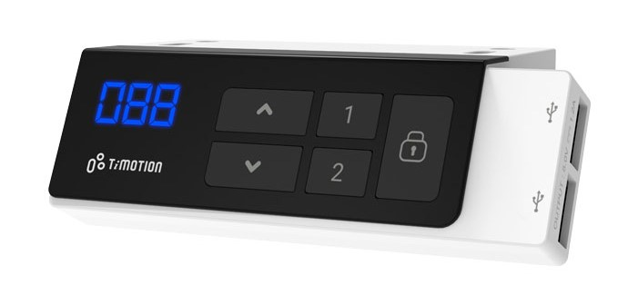

Fork of [esphome-idasen-desk-controller](https://github.com/j5lien/esphome-idasen-desk-controller) for  [TiMOTION TWD1 Series](https://www.timotion.com/en/products/accessories/twd1-series) controller bluetooth module.  
Alternative for [Stand Up Pls.](https://play.google.com/store/apps/details?id=com.timotion.standuppls) android app.  
 


  
## BT communication protocol - reverse engineering

```bash
# example module notifications
                                   | value part
02 03 20 0c 00 08 00 04 00 1b 0b 00 99 42 01 60 3c
02 03 20 0c 00 08 00 04 00 1b 0b 00 99 41 01 60 3b
02 03 20 0c 00 08 00 04 00 1b 0b 00 99 40 01 73 4d
                                                /\ checksum(?)
                                             /\ desk height in hex
                                       /\ move status: 40 idle, 41 down, 42 up
# example commands send by mobile app
                                   | value part
02 03 00 0c 00 08 00 04 00 52 0e 00 d9 ff 01 60 39
02 03 00 0c 00 08 00 04 00 52 0e 00 d9 ff 02 60 3a
                                                /\ checksum(?)
                                             /\ last recaived height
                                          /\ move direction: 01 up, 02 down
```
Reading status is quite simple, just decode height and status hex value from notification.  
Sending command seems complicated due to previous height and checksum calculated from the entire packet, but on the end module is validating only checksum, without checking whether height is correct, so we can always send the same command value, eg. `0xd9ff01633c` for the up command, and `0xd9ff02603a` for the down command.  
  
## Dependencies
* This component requires an [ESP32 device](https://esphome.io/devices/esp32.html).
* [ESPHome 2021.10.0 or higher](https://github.com/esphome/esphome/releases).
* standing desk controller [TiMOTION TDH18P](https://www.timotion.com/en/products/controls/tdh18p-series)
* bluetooth module [TiMOTION TWD1](https://www.timotion.com/en/products/accessories/twd1-series).

## Installation
! If necessary, just follow original instruction of [esphome-idasen-desk-controller](https://github.com/j5lien/esphome-idasen-desk-controller)

You can install this component with [ESPHome external components feature](https://esphome.io/components/external_components.html) like this:
```yaml
external_components:
  - source: github://duchu-net/esphome-timotion-desk-controller@v0.0.2
  # or clone, and serve from locally
  - source:
      type: local
      path: components/esphome-timotion-desk-controller/components
```

## Configuration
ESPHome `yaml` example: [esphome-timotion-desk-controller.yaml](./esphome-timotion-desk-controller.yaml).

## TiMOTION Trademark Notice
The TiMOTION name and logo are trademarks of TiMOTION Technology Co. Ltd. All Rights Reserved. Is not part of the licensing for this project.